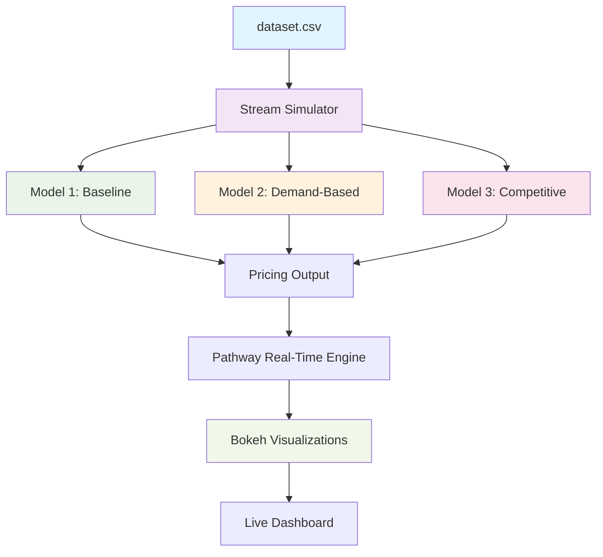

# Dynamic Pricing for Urban Parking Lots – Real-Time Simulation

[](https://www.python.org/downloads/)
[](https://pandas.pydata.org/)
[](https://numpy.org/)
[](https://bokeh.org/)
[](https://pathway.com/)

> **Capstone Project – Summer Analytics 2025**  
> Real-time dynamic pricing engine for urban parking lots using intelligent pricing models

## Table of Contents
- [Overview](#overview)
- [Tech Stack](#tech-stack)
- [Architecture](#architecture)
- [Models](#models)
- [Installation](#installation)
- [Usage](#usage)
- [Output](#output)
- [Project Structure](#project-structure)
- [Contributing](#contributing)
- [References](#references)

## Overview

Urban parking spaces have variable demand throughout the day. Static pricing leads to poor utilization and revenue optimization. This project implements three intelligent pricing models for real-time dynamic pricing, simulating actual city environments using real parking data.

### Key Features
- Real-time streaming simulation using Pathway
- Three-tier pricing models of increasing complexity
- Live visualizations with Bokeh dashboard
- Geospatial competition analysis
- Smart rerouting suggestions

## Tech Stack

| Component | Technology | Purpose |
|-----------|------------|---------|
| **Language** | Python 3.8+ | Core programming |
| **Data Processing** | Pandas, NumPy | Data manipulation & calculations |
| **Real-time Streaming** | Pathway | Live data processing |
| **Visualization** | Bokeh | Interactive dashboards |
| **Runtime** | Google Colab | Cloud execution |

## Architecture

### System Flow
1. Data Ingestion: `dataset.csv` is streamed via Pathway
2. Model Processing: Three pricing models compute real-time prices
3. Output Generation: Pricing decisions and rerouting suggestions
4. Visualization: Real-time Bokeh dashboard updates

### Architecture Diagram



## Models

### Model 1: Baseline Linear Pricing
- **Formula**: `Price_t+1 = Price_t + α × (Occupancy / Capacity)`
- **Features**: Smooth linear price increase with occupancy
- **Use Case**: Foundation pricing strategy

### Model 2: Demand-Based Pricing
- **Formula**: `Demand = α*(Occupancy/Capacity) + β*QueueLength - γ*Traffic + δ*IsSpecialDay + ε*VehicleTypeWeight`
- **Features**: Multi-factor demand prediction
- **Use Case**: Advanced demand forecasting

### Model 3: Competitive Pricing
- **Features**: Geospatial competition using Haversine distance
- **Logic**: 3-nearest competitor analysis
- **Output**: Dynamic pricing + rerouting suggestions
- **Use Case**: Market-aware pricing strategy

## Installation

### Prerequisites
- Python 3.8 or higher
- pip package manager

### Setup Instructions

1. **Clone the repository**
   ```bash
   git clone <repository-url>
   cd capstoneproject_iitguwahati
   ```

2. **Install dependencies**
   ```bash
   pip install pandas numpy bokeh pathway
   ```
   > **Note:** For the latest and most compatible dependency versions, refer to the official [Pathway LLM App pyproject.toml](https://github.com/pathwaycom/llm-app/blob/main/pyproject.toml).

3. **Verify installation**
   ```bash
   python -c "import pandas, numpy, bokeh; print('All dependencies installed successfully!')"
   ```

## Usage

### Quick Start

1. **Prepare your data**
   ```bash
   # Ensure dataset.csv is in the project root
   ls dataset.csv
   ```

2. **Run the simulation**
   ```bash
   python main.py
   ```

3. **Access the dashboard**
   - The Bokeh dashboard will automatically open in your browser
   - Real-time pricing updates will be displayed
   - Interactive charts show all three models' performance

### Advanced Usage

#### Running Individual Models
```bash
# Test baseline model
python models/model1_baseline.py

# Test demand-based model
python models/model2_demand_based.py

# Test competitive model
python models/model3_competitive.py
```

#### Custom Parameters
Edit the model parameters in respective files:
- `models/model1_baseline.py`: Adjust `alpha` parameter
- `models/model2_demand_based.py`: Modify coefficients (α, β, γ, δ, ε, λ)
- `models/model3_competitive.py`: Change competition radius

## Output

### Real-time Features
- Live price plots for each parking lot
- Rerouting suggestions (Model 3)
- Occupancy overlays and queue length indicators
- Smooth, explainable pricing transitions

### Dashboard Elements
- Multi-line charts showing all three models
- Interactive legends for model comparison
- Real-time updates as data streams
- Responsive design for different screen sizes

## Project Structure

```
capstoneproject_iitguwahati/
├── dataset.csv                 # Parking lot data (18,370 records)
├── models/
│   ├── model1_baseline.py     # Baseline linear pricing model
│   ├── model2_demand_based.py # Demand-based pricing model
│   └── model3_competitive.py  # Competitive pricing model
├── stream_simulator.py        # Pathway-based streaming simulation
├── visualization.py           # Bokeh real-time dashboard
├── utils.py                   # Utility functions (Haversine, encoding)
├── main.py                    # Main controller (Colab-compatible)
└── README.md                  # This file
```

## Constraints & Limitations

- No external ML libraries: Only manual mathematical modeling
- Price bounds: All prices maintained between 0.5×BasePrice and 2×BasePrice
- Smooth transitions: No sudden price spikes
- Dependencies: Limited to Pandas, NumPy, Pathway, and Bokeh

## Contributing

1. Fork the repository
2. Create a feature branch (`git checkout -b feature/AmazingFeature`)
3. Commit your changes (`git commit -m 'Add some AmazingFeature'`)
4. Push to the branch (`git push origin feature/AmazingFeature`)
5. Open a Pull Request

## License

This project is part of the **Summer Analytics 2025 Capstone Project**.

---

## References
- [Pathway LLM App Example Pipelines](https://github.com/pathwaycom/llm-app/blob/main/pyproject.toml)
- [ChatGPT Session Reference](https://chatgpt.com/c/6868d95d-c844-800c-984e-d88b7cbb1a4e)

Built for intelligent urban mobility solutions.